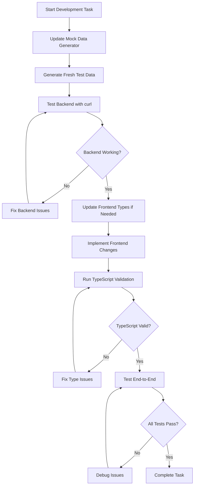

## Workflow Guidelines

### Data Model Change Process (Agile Approach)

1. **Schema Changes**:
   - Update DDL files in `postgresql-ddl/`
   - Update backend models in `models.py`
   - Update frontend types in `types/mockData.ts`
   - Update mock data generator
   - Test with fresh mock data

2. **Handling Mismatches**:
   - Document any mismatches between frontend expectations and backend responses
   - Discuss with the team to decide on the correct approach
   - Implement the agreed-upon solution
   - Update both frontend and backend to match

3. **Validation Strategy**:
   - Backend: Enforce all validation through PostgreSQL constraints, triggers, and foreign keys
   - Frontend: No client-side validation (as per decision)
   - Error handling: Display developer debugging information, user-facing messages to be decided later

### Development Workflow



### Testing Protocol

1. **Backend Testing**:
   ```bash
   # Test endpoints directly with curl
   curl -X GET http://localhost:8000/api/projects
   curl -X POST http://localhost:8000/api/projects -d '{"name":"Test"}' -H "Content-Type: application/json"
   ```

2. **Frontend Validation**:
   ```bash
   cd frontend
   npx tsc --noEmit
   ```

3. **End-to-End Testing**:
   - Generate fresh mock data
   - Test all CRUD operations through the UI
   - Verify data relationships and constraints

## Error Handling Guidelines

### Backend Errors

1. **Format**:
   ```json
   {
     "error": {
       "code": "VALIDATION_ERROR",
       "message": "Detailed developer message",
       "details": {
         "field": "specific error details"
       }
     }
   }
   ```

2. **HTTP Status Codes**:
   - 400: Validation errors
   - 404: Resource not found
   - 422: Unprocessable entity (constraint violations)
   - 500: Internal server error

3. **Logging**:
   - Log detailed error information for debugging
   - Include stack traces for unexpected errors

### Frontend Errors

1. **Display**:
   - Show developer debugging information in console
   - User-facing messages to be implemented later

2. **Handling**:
   - Implement try-catch blocks for all API calls
   - Set appropriate error states in context
   - Allow retry operations where applicable

## Technical Decisions

### Date/Time Handling

- **Standard Format**: ISO 8601 strings (`YYYY-MM-DDTHH:mm:ss.sssZ`)
- **Backend Conversion**: Use PostgreSQL's native date/time functions
- **Frontend**: Keep existing ISO string handling

### Validation Strategy

- **Backend Only**: Enforce all validation through PostgreSQL
- **No Client-Side Validation**: Avoid redundancy
- **Error Propagation**: Return detailed PostgreSQL errors to frontend

### Data Relationships

- **Mock Data**: Must validate all relationships and enum values
- **Edge Cases**: Not considered in initial implementation
- **Error Scenarios**: Frontend should display PostgreSQL errors