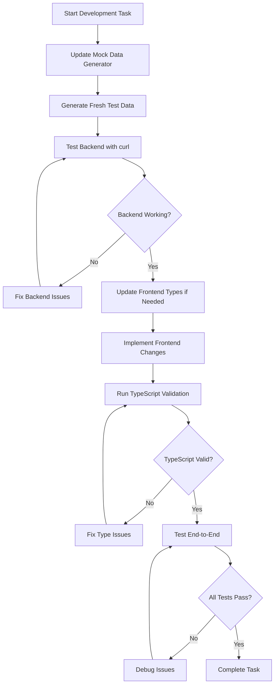

# Phase 2: Frontend to Backend Integration with PostgreSQL

## Overview

This document outlines the comprehensive plan for Phase 2 of the Event Horizon Planner project - connecting the frontend React application to the FastAPI backend with PostgreSQL database integration.

## Data Model Analysis

### Key Findings

1. **Date/Time Format Handling**
   - Decision: Standardize on ISO strings throughout the application
   - Backend will handle conversion between ISO strings and PostgreSQL's native DATE/TIMESTAMP formats
   - PostgreSQL's `TO_JSON` and `TO_TIMESTAMP` functions will be utilized for seamless conversion

2. **UUID Handling**
   - Frontend uses string UUIDs
   - Database uses native UUID type
   - Backend already converts UUID to string in database.py (lines 28-31)

3. **Enum Values**
   - All enum values match between frontend and backend
   - PostgreSQL enums are properly defined in the DDL

4. **Task Dependencies**
   - Frontend expects arrays of task names and IDs
   - Backend needs proper implementation for task dependency CRUD operations

5. **Knowledge Base References**
   - Frontend has complex nested reference structures
   - Backend needs proper handling of the join tables

## Implementation Plan

### 1. Mock Data Generator Script

Create a comprehensive script to generate mock data that aligns with the database schema:

**Location**: `backend/scripts/generate_mock_data.py`

**Features**:
- Clear existing data in proper order (respecting foreign keys)
- Generate realistic mock data matching frontend expectations
- Insert data into PostgreSQL tables
- Verify data integrity and relationships
- Support for all enum values and constraints

**Usage**:
```bash
cd backend
python scripts/generate_mock_data.py
```

### 2. Vite Proxy Configuration

Update Vite config to proxy API requests to the backend:

**File**: `frontend/vite.config.ts`

**Changes**:
- Add server.proxy configuration to route `/api` requests to `http://localhost:8000`
- Enable CORS handling through the proxy

### 3. Real API Client Implementation

Create a new API client to replace the mock API:

**Location**: `frontend/src/data/api/realApi.ts`

**Features**:
- HTTP requests using fetch API
- Proper error handling with developer-friendly messages
- Automatic handling of ISO date conversions
- Consistent response format matching mock API structure

### 4. Backend API Enhancements

#### Required Enhancements:

1. **Task Dependency Endpoints** (`/api/tasks/{id}/dependencies`)
   - GET: Retrieve all dependencies for a task
   - POST: Add a new dependency
   - DELETE: Remove a dependency

2. **Knowledge Base Reference Management** (`/api/knowledge/{id}/references`)
   - GET: Retrieve all references for a knowledge base item
   - POST: Add a new reference
   - DELETE: Remove a reference

3. **View Endpoints**
   - `/api/projects/dashboard` - Project dashboard data
   - `/api/tasks/details/{id}` - Detailed task information
   - `/api/goals/progress` - Goal progress information
   - `/api/knowledge/with-references` - Knowledge base with references

4. **Error Handling Improvements**
   - Structured error responses with detailed developer information
   - Proper HTTP status codes
   - Consistent error format across all endpoints

### 5. Frontend Integration Steps

1. **Update AppContext** (`frontend/src/contexts/AppContext.tsx`)
   - Replace mockApi imports with realApi
   - Add error handling for API failures
   - Implement loading states during API calls

2. **Data Transformation**
   - Handle ISO date conversions
   - Maintain compatibility with existing frontend components
   - Preserve data structures expected by UI components

3. **Testing Updates**
   - Update test expectations to work with real data
   - Ensure TypeScript validation passes

## Workflow Guidelines

### Data Model Change Process (Agile Approach)

1. **Schema Changes**:
   - Update DDL files in `postgresql-ddl/`
   - Update backend models in `models.py`
   - Update frontend types in `types/mockData.ts`
   - Update mock data generator
   - Test with fresh mock data

2. **Handling Mismatches**:
   - Document any mismatches between frontend expectations and backend responses
   - Discuss with the team to decide on the correct approach
   - Implement the agreed-upon solution
   - Update both frontend and backend to match

3. **Validation Strategy**:
   - Backend: Enforce all validation through PostgreSQL constraints, triggers, and foreign keys
   - Frontend: No client-side validation (as per decision)
   - Error handling: Display developer debugging information, user-facing messages to be decided later

### Development Workflow



### Testing Protocol

1. **Backend Testing**:
   ```bash
   # Test endpoints directly with curl
   curl -X GET http://localhost:8000/api/projects
   curl -X POST http://localhost:8000/api/projects -d '{"name":"Test"}' -H "Content-Type: application/json"
   ```

2. **Frontend Validation**:
   ```bash
   cd frontend
   npx tsc --noEmit
   ```

3. **End-to-End Testing**:
   - Generate fresh mock data
   - Test all CRUD operations through the UI
   - Verify data relationships and constraints

## Error Handling Guidelines

### Backend Errors

1. **Format**:
   ```json
   {
     "error": {
       "code": "VALIDATION_ERROR",
       "message": "Detailed developer message",
       "details": {
         "field": "specific error details"
       }
     }
   }
   ```

2. **HTTP Status Codes**:
   - 400: Validation errors
   - 404: Resource not found
   - 422: Unprocessable entity (constraint violations)
   - 500: Internal server error

3. **Logging**:
   - Log detailed error information for debugging
   - Include stack traces for unexpected errors

### Frontend Errors

1. **Display**:
   - Show developer debugging information in console
   - User-facing messages to be implemented later

2. **Handling**:
   - Implement try-catch blocks for all API calls
   - Set appropriate error states in context
   - Allow retry operations where applicable

## Technical Decisions

### Date/Time Handling

- **Standard Format**: ISO 8601 strings (`YYYY-MM-DDTHH:mm:ss.sssZ`)
- **Backend Conversion**: Use PostgreSQL's native date/time functions
- **Frontend**: Keep existing ISO string handling

### Validation Strategy

- **Backend Only**: Enforce all validation through PostgreSQL
- **No Client-Side Validation**: Avoid redundancy
- **Error Propagation**: Return detailed PostgreSQL errors to frontend

### Data Relationships

- **Mock Data**: Must validate all relationships and enum values
- **Edge Cases**: Not considered in initial implementation
- **Error Scenarios**: Frontend should display PostgreSQL errors

## Implementation Priority

1. **High Priority**:
   - Mock data generator script
   - Vite proxy configuration
   - Basic CRUD operations (Projects, Goals, Tasks)

2. **Medium Priority**:
   - Enhanced views (dashboard, task details, goal progress)
   - Task dependency management
   - Knowledge base references

3. **Low Priority**:
   - Advanced filtering and sorting
   - Performance optimizations
   - Caching strategies

## Migration Path

### Phase 2.1: Core Integration
1. Create mock data generator
2. Set up Vite proxy
3. Implement basic CRUD operations
4. Test end-to-end data flow

### Phase 2.2: Enhanced Features
1. Implement view endpoints
2. Add task dependencies
3. Add knowledge base references
4. Improve error handling

### Phase 2.3: Polish & Optimize
1. Performance optimizations
2. Advanced filtering
3. Caching strategies
4. User experience improvements

## Success Criteria

1. All basic CRUD operations working end-to-end
2. Frontend displays data from PostgreSQL database
3. TypeScript validation passes without errors
4. Mock data generator creates consistent, valid data
5. Error handling provides useful debugging information

## Next Steps

1. Create mock data generator script
2. Set up Vite proxy configuration
3. Implement real API client
4. Update frontend to use real API
5. Test and validate integration

---

*This document will be updated as we progress through Phase 2 implementation.*